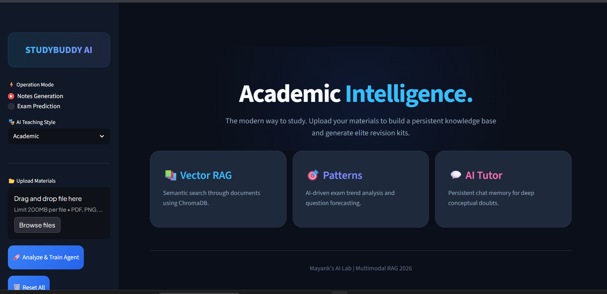
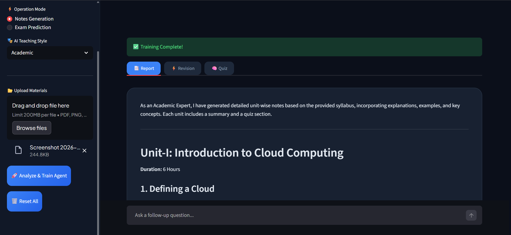
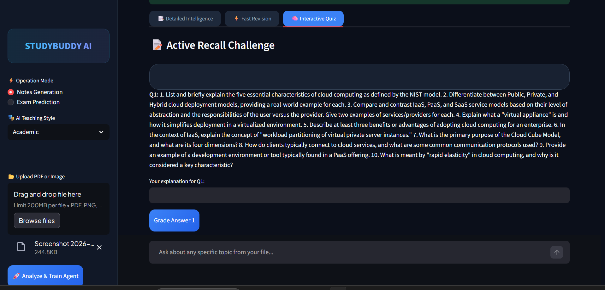

<<<<<<< HEAD
# 🎓 StudyBuddy AI: The Ultimate Exam Saver

  

Let's be honest: Engineering syllabuses are huge, and old question papers (PYQs) are usually just messy PDFs or blurry photos. **StudyBuddy AI** is a smart tool I built to help students stop wasting time and start studying what actually matters.

It uses **Gemini 2.5 Flash** to "read" your documents and tell you exactly what to focus on.

---

# 🚀 What can it do? (Features)

### 📝 Syllabus to Notes
Upload a photo of your syllabus, and the AI writes detailed notes for every unit. It even marks topics as **`[HIGH PRIORITY]`** so you know what's important.

  

### 🔮 Exam Predictor
Feed it your Previous Year Questions (PYQs). It finds patterns and predicts which 10-mark questions are most likely to come this year.

### ⚡ Quick Cheat Sheet
Automatically creates a 1-page revision guide for last-minute study.

### 🧠 Self-Test Quiz
Generates a 5-question MCQ quiz after every analysis to see if you actually understood the topic.

  

### ✍️ Handwriting Reader
It can read text from clear photos, not just clean PDFs.

---
=======
# 🎓 StudyBuddy AI Pro: Persistent RAG Tutor
The most advanced Multimodal AI Agent for engineering students. Most AI tools just "read" a file and forget it. StudyBuddy AI Pro is different. It builds a Persistent Knowledge Base from your PDFs and images using a Vector Database, allowing you to have a real-time, context-aware conversation with your entire syllabus.

# 🚀 Key Engineering Features
Vectorized Knowledge Ingestion: Uses ChromaDB to embed and store document data as mathematical vectors for high-speed semantic retrieval.

Multimodal Intelligence: Powered by Gemini 2.5 Flash to analyze everything from clean PDFs to blurry handwritten exam papers.

Context-Aware Chatbot: An interactive tutor with Session Memory that remembers your previous doubts and provides "Genuine Help" based only on your uploaded materials.

Exam Pattern Analytics: Identifies high-frequency topics in Previous Year Questions (PYQs) and forecasts likely 10-mark questions using Chain-of-Thought reasoning.

Automated Academic Synthesis: Generates unit-wise notes, last-minute cheat sheets, and active-recall quizzes instantly.

# 🛠️ Technical Architecture (The Stack)
I architected this using a modern AI Agent workflow:
>>>>>>> f4da2b1 (chore: save local changes before rebase)

Language: Python 3.10+

<<<<<<< HEAD
* **Python:** The main language for all the logic.
* **Google Gemini 2.5 Flash:** The "Brain" that reads the images and understands the engineering concepts.
* **LangChain:** The bridge that connects the AI to our app's specific goals.
* **RAG (In-Memory):** A technique where the AI "retrieves" the specific text from your file to give accurate answers instead of just guessing.
* **Streamlit:** Used for the modern "Dark Mode" website interface.
* **PyPDF2 & Pillow:** To help the AI "see" and "read" PDFs and Images.
=======
Orchestration: LangChain (LCEL) for building stable, modular retrieval pipelines.

Vector Database: ChromaDB for efficient document indexing and semantic search.

LLM & Embeddings: Google Gemini 2.5 Flash & text-embedding-004 for high-reasoning capabilities.

UI/UX: Streamlit with a custom Glassmorphism Dark Theme and responsive state management.

Data Processing: PyPDF2 for complex PDF parsing and Pillow for OCR-based image processing.

# 🧠 The "RAG" Advantage
Unlike standard LLMs that "hallucinate," this project uses Retrieval-Augmented Generation.

Chunking: Documents are broken into 1,000-character segments with overlap.

Embedding: Text is converted into vectors using Google’s embedding models.

Retrieval: When a student asks a doubt, the system finds the exact 3 most relevant segments in the database to formulate an answer.
>>>>>>> f4da2b1 (chore: save local changes before rebase)
